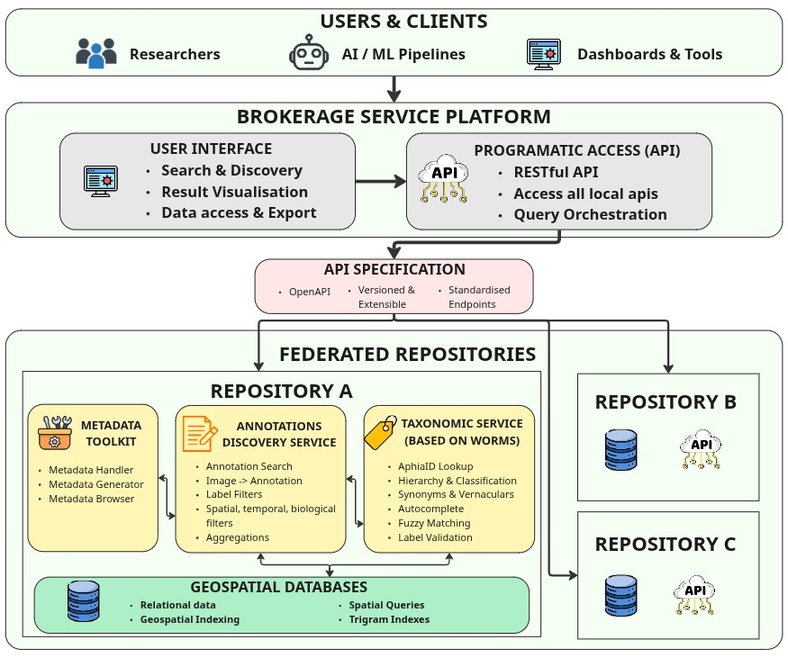

# Platform overview

The Paidiver Image Brokerage Service makes independently operated image-annotation APIs discoverable through one federated API and user interface. Data owners retain their own database and deployment while the brokerage service provides a common point for discovery and search.

## Components

| Component | Responsibility |
| --- | --- |
| [Brokerage Service API](https://github.com/paidiver/brokerage-service-api) | Discovers configured sources, federates searches, monitors source health, and caches search sessions in Redis. |
| [Brokerage Service UI](https://github.com/paidiver/brokerage-service-ui) | User-facing search and discovery interface. |
| [Annotations API](https://github.com/paidiver/annotations-api) | Stores image, annotation, label, and related metadata in PostgreSQL/PostGIS. Each organisation can operate its own instance. |
| [WoRMS Cache](https://github.com/paidiver/worms-cache) | Caches marine taxonomy, classification, synonyms, vernacular names, and name indexes used by annotation workflows. |
| [Paidiverpy](https://github.com/paidiver/paidiverpy) | Processing tools designed to create pipelines for preprocessing image data for biodiversity analysis. Also provides utilities to handle image metadata. |

.. image:: _static/architecture.jpg
    :alt: Architecture Diagram

## Two ways to provide a repository

### Option 1: implement the API contract over your own database

Use this path when you already have a database or service. Your storage technology and internal schema can be anything. Build a REST API adapter that implements the [Brokerage Annotation Source API contract](api-contract), then register its base URL with the Brokerage Service API.

Only the endpoints and response fields used by the broker are part of the compatibility contract. You do not need Django, PostgreSQL, PostGIS, WoRMS Cache, or the Paidiver ingestion model unless they are useful to your implementation.

### Option 2: deploy the provided data stack

Use this path when you do not have a database, want the supplied geospatial schema, or prefer the reference implementation. Deploy:

* **Annotations API** for the REST API and PostgreSQL/PostGIS-backed annotation model.
* **WoRMS Cache** for marine taxonomy lookup, validation, autocomplete, synonyms, and classification.
* **Taxamatch**, included with WoRMS Cache, for fuzzy scientific-name matching.

Follow [local deployment](local-deployment), [data ingestion](data-ingestion), and then [source registration](register-source).

## End-to-end data flow

1. A provider exposes a contract-compatible annotation source, either custom or using the supplied stack.
2. The source is registered with a stable identifier and base URL.
3. The Brokerage Service API checks source health and sends contract-defined requests.
4. Responses from enabled sources are validated, combined, ordered, and optionally cached.
5. Researchers, applications, and the Brokerage UI discover and export federated results.
